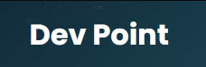

# 🐉 Ryan Tomaz

**`Desenvolvedor Web`**

Me chamo Ryan Tomaz Talaveira, tenho 16 anos e sou natural do Paraná. Atualmente, estou cursando o ensino médio na UTFPR, sendo o curso técnico em desenvolvimento web. Sou apaixonado por conhecimento e atleta de judô

     
    

---

### 🤖 Linguagens e Tecnologias

 
 

<h2 align="left">🛠️Alguns Projetos. Clique para vê-los</h2>

<h3 align="left">Não responsivo</h3>
  
<h3 align="left">Responsivo</h3>
  

###

### 📊 Estatísticas

  

